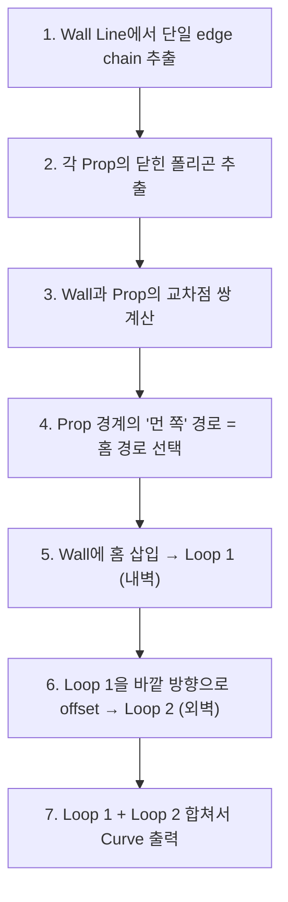

# Wall Groove 기능 명세서 (v2)

## 목표

Wall Line(단일 벽 라인)에 Prop Line 위치에 맞는 **홈(groove)**을 파고,
**바깥 방향으로 오프셋된 2번째 라인**을 자동 생성하여 이중 격벽을 만드는 블렌더 애드온.

---

## 용어 정의

| 용어 | 설명 |
|------|------|
| **Wall Line** | 건물 외벽을 나타내는 **단일 폴리라인** (닫힌/열린) |
| **Prop Line** | 프랍 위치를 나타내는 **닫힌 폴리곤** (사각형 등) |
| **Groove** | Wall에서 Prop 구간을 Prop 안쪽으로 우회하는 ㄷ자 라인 |
| **Outer Wall** | Wall Line의 **바깥 방향**으로 오프셋된 2번째 라인 |
| **Wall Thickness** | 내벽(Wall)과 외벽(Outer Wall) 사이 간격 (파라미터) |

---

## 입출력

### 입력
| 역할 | 선택 방식 | 타입 |
|------|-----------|------|
| **Wall Line** | Active Object | Mesh 또는 Curve (단일 라인) |
| **Prop Lines** | Other Selected | Mesh 또는 Curve (닫힌 폴리곤, 복수 가능) |

### 파라미터
| 이름 | 기본값 | 설명 |
|------|--------|------|
| `wall_thickness` | 0.1 | 내벽-외벽 사이 두께 |

### 출력
- **새 Curve 오브젝트** 1개 (2개 loop 포함):
  - Loop 1: Wall Line + Groove (내벽)
  - Loop 2: Outer Wall + Groove (외벽, 바깥으로 오프셋)
- 원본 오브젝트 숨김

---

## 동작 설명

### Step 1: 홈(Groove) 생성

Wall Line에서 Prop이 걸치는 구간을 찾아 ㄷ자 홈을 만듦:

```
Before:
   Wall Line: ────────────────────────
                    ┌───┐
   Prop:            │   │
                    └───┘

After (내벽 = Loop 1):
              ──────┐   ┌────────────
                    │   │
                    └───┘  ← Prop 경계를 따라 우회
```

### Step 2: 이중 격벽 (Outer Wall) 생성

내벽 라인의 **바깥 방향으로 오프셋**하여 외벽 라인 생성:

```
최종 결과 (2개 loop):

   Outer Wall: ═══════════╗   ╔═════════════  ← Loop 2 (오프셋)
   Wall Line:  ───────────╢   ╟─────────────  ← Loop 1 (원본+홈)
                          ║   ║
               thickness→ ╠═══╣
                          ║   ║
                          ╚═══╝
```

좀 더 현실적인 형태:
```
   ┌──────────────────────────────┐  ← Outer Wall (Loop 2)
   │ ┌──────────────────────────┐ │  ← Wall Line (Loop 1)
   │ │                          │ │
   │ │                          │ │
   │ └──┐ ┌──────────┐ ┌───────┘ │
   └────┐ │ ┌────────┐ │ ┌───────┘
        │ │ │        │ │ │
        └─┘ └────────┘ └─┘
         ↑                ↑
      Prop A 홈        Prop B 홈
```

> [!IMPORTANT]
> Wall Line = 내벽 (Loop 1), Outer Wall = 외벽 (Loop 2)
> 둘 다 Prop 위치에서 동일한 형태의 홈이 파집니다.
> Outer Wall의 홈은 Wall Line 홈보다 `wall_thickness`만큼 바깥에 위치합니다.

---

## 알고리즘



### 오프셋 방향 결정

Wall Line의 각 edge에서 **법선(normal)** 방향을 계산:
```python
edge_dir = (v2 - v1).normalized()  # edge 방향
normal = Vector(-edge_dir.y, edge_dir.x)  # 90° 회전 = 법선

# 닫힌 폴리곤의 경우:
# 폴리곤 내부 방향과 반대 = 바깥 방향
# → winding order로 판별하거나 signed area로 결정
```

---

## 제약 조건

1. **Wall Line은 단일 라인** (다중 loop 아님)
2. **Groove 깊이** = Prop 폴리곤의 실제 크기 (자동)
3. **내부 면 불필요** — Line만 생성
4. **다중 Prop** — 각각 독립 groove
5. **Outer Wall은 애드온이 자동 생성** (GN 불필요)
