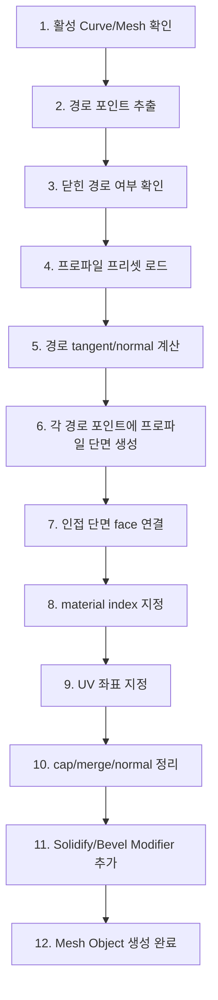

# 커브 → 프로파일 몰딩 벽 생성 애드온 구현 계획서

* 초안 작성: Opus 4.6
* 1차 수정: GPT-5.5
* 보완 검토: Opus 4.6, Gemini 3.1 Pro
* 구현용 정리: GPT-5.5

## 1. 목표

현재 Geometry Nodes로 만든 몰딩 벽을 Python 애드온으로 대체한다.
목표는 단순히 같은 결과를 복제하는 것이 아니라, 이후 다른 디자인 벽을 쉽게 추가할 수 있는 **프로파일 기반 벽 생성 시스템**을 만드는 것이다.

핵심 개념:

```text
커브 1줄 = 벽이 따라갈 경로
프로파일 = 벽의 세로 단면 디자인
애드온 = 경로를 따라 프로파일을 연결해서 메시 생성
```

현재 GN 방식은 일반 벽을 먼저 만든 뒤 상단/하단/중앙을 찾아 Extrude와 Material 지정으로 후처리한다.
새 벽 디자인이 추가될수록 노드 조건과 연결이 복잡해진다.

개선 방식은 벽 단면을 데이터로 정의하고, 생성 시점에 이미 상단 Trim, 하단 Trim, 중앙 Body를 구분한다.
따라서 디자인 추가는 노드 수정이 아니라 프로파일 프리셋 추가로 처리한다.

---

## 2. 구현 범위

### 1차 MVP

- 선택한 Curve Poly Line에서 경로 포인트 추출
- 기본 몰딩 프로파일 벽 생성
- Body / Trim 재질 자동 할당
- 열린 커브와 닫힌 커브 대응
- `wall_thickness`는 Solidify Modifier로 적용
- Generate 버튼
- 기본 에러 처리
- 기본 UV 생성

### 2차

- Update 버튼
- 원본 커브와 생성 메시 연결
- Flip Direction 옵션
- Bezier Curve 샘플링
- Miter 코너 처리
- Height Scale / Offset Scale

### 3차

- 여러 벽 디자인 프리셋 추가
- Bevel Modifier 옵션
- Cap 끝면 품질 개선
- Solidify 방식에서 직접 양면 프로파일 생성 방식으로 전환 검토
- Unity 6 내보내기용 정리 옵션

### 4차

- 평지붕 / 박공지붕 모듈
- Prop 홈(groove) 모듈
- 문 / 창문 컷아웃
- 프리셋 파일 외부 JSON 저장 검토

---

## 3. 애드온 구조

```text
profile_wall_generator/
├── __init__.py
├── properties.py
├── operators.py
├── panels.py
├── profile_presets.py
├── path_utils.py
├── mesh_builder.py
├── material_utils.py
├── uv_utils.py
└── update_utils.py
```

### `__init__.py`

- `bl_info` 정의
- 클래스 등록/해제
- Scene PropertyGroup 등록

```python
bl_info = {
    "name": "Profile Wall Generator",
    "author": "Kim Dongsu",
    "version": (1, 0, 0),
    "blender": (5, 1, 0),
    "location": "View3D > Sidebar > K-Quick Tools",
    "description": "Generate profile molding walls from curves",
    "category": "Mesh",
}
```

### `properties.py`

UI와 오퍼레이터가 공유하는 설정값을 정의한다.

필수 속성:

| 이름 | 타입 | 기본값 | 설명 |
|------|------|--------|------|
| `profile_preset` | Enum | `BASIC_MOLDING` | 사용할 벽 디자인 |
| `wall_thickness` | Float | `0.1` | 벽 두께 |
| `thickness_direction` | Enum | `OUTSIDE` | Solidify 방향 |
| `height_scale` | Float | `1.0` | 프로파일 높이 배율 |
| `offset_scale` | Float | `1.0` | 몰딩 돌출량 배율 |
| `flip_direction` | Bool | `False` | 몰딩 방향 반전 |
| `cap_ends` | Bool | `True` | 열린 커브 양 끝 막기 |
| `merge_distance` | Float | `0.001` | 중복 포인트/정점 병합 거리 |
| `uv_scale_u` | Float | `1.0` | 경로 방향 UV 스케일 |
| `uv_scale_v` | Float | `1.0` | 높이 방향 UV 스케일 |
| `add_bevel` | Bool | `False` | Bevel Modifier 추가 |
| `bevel_width` | Float | `0.01` | Bevel 두께 |
| `hide_source_curve` | Bool | `True` | 생성 후 원본 커브 숨김 |
| `body_material` | Pointer | None | 중앙 Body 재질 |
| `trim_material` | Pointer | None | 몰딩 Trim 재질 |

### `profile_presets.py`

벽 디자인 데이터를 관리한다.
새 벽 디자인은 이 파일에 프리셋을 추가한다.

프로파일의 각 포인트는 `(z, offset, material_key)` 형식을 사용한다.

```python
PROFILE_PRESETS = {
    "BASIC_MOLDING": {
        "label": "Basic Molding",
        "profile": [
            (0.00, 0.08, "trim"),
            (0.20, 0.08, "trim"),
            (0.30, 0.00, "body"),
            (2.70, 0.00, "body"),
            (2.80, 0.08, "trim"),
            (3.00, 0.08, "trim"),
        ],
    },
    "DOUBLE_TRIM": {
        "label": "Double Trim",
        "profile": [
            (0.00, 0.10, "trim"),
            (0.15, 0.10, "trim"),
            (0.25, 0.03, "body"),
            (1.45, 0.00, "body"),
            (1.60, 0.05, "trim"),
            (1.75, 0.00, "body"),
            (2.75, 0.03, "body"),
            (2.85, 0.10, "trim"),
            (3.00, 0.10, "trim"),
        ],
    },
}
```

주의:

- `offset`은 벽 두께가 아니라 몰딩 돌출량이다.
- `wall_thickness`는 별도 파라미터로 관리한다.
- 프로파일은 아래에서 위로 정렬되어 있어야 한다.

### `path_utils.py`

입력 오브젝트에서 벽 경로를 추출한다.

담당 기능:

- Curve Poly Spline 포인트 추출
- Bezier Curve 샘플링
- Mesh Edge Chain 포인트 추출
- 닫힌 경로 여부 확인
- 너무 가까운 중복 포인트 제거
- 경로의 Z 값을 기준 평면으로 정리
- 닫힌 커브의 winding order 계산

### `mesh_builder.py`

프로파일 벽 메시를 생성하는 핵심 모듈이다.

담당 기능:

- 경로 누적 길이 계산
- 각 경로 포인트의 tangent 계산
- 각 경로 포인트의 outward normal 계산
- 프로파일 단면 정점 생성
- 인접 단면끼리 face 연결
- 닫힌 경로의 마지막/첫 단면 연결
- 열린 경로의 cap face 생성
- material index 지정
- UV 좌표 저장
- mesh validate / update

### `uv_utils.py`

메시의 UV 좌표를 계산한다.

기본 방식:

```text
U = 경로 시작점부터 현재 위치까지의 누적 거리 * uv_scale_u
V = 프로파일 z 높이 또는 프로파일 누적 길이 * uv_scale_v
```

MVP에서는 `V = z`를 사용한다.
몰딩의 꺾임을 따라 텍스처를 더 정확히 펴야 하면 2차 이후 `V = profile cumulative length` 방식으로 전환한다.

### `material_utils.py`

재질 슬롯을 준비하고 material key를 material index로 변환한다.

기본 material key:

- `body`
- `trim`
- `cap`

권장 기본값:

- `body`: 사용자가 지정한 Body Material 또는 자동 생성
- `trim`: 사용자가 지정한 Trim Material 또는 자동 생성
- `cap`: Body Material 사용

### `operators.py`

사용자 실행 기능을 정의한다.

#### `PROFILE_WALL_OT_generate`

선택한 Curve/Mesh 라인에서 새 프로파일 벽을 생성한다.

처리 순서:

1. 활성 오브젝트 검증
2. 경로 포인트 추출
3. 프로파일 프리셋 로드
4. 메시 생성
5. UV 생성
6. 재질 슬롯 할당
7. Solidify Modifier 추가
8. 선택 옵션에 따라 Bevel Modifier 추가
9. 원본 커브와 생성 메시 연결 속성 저장
10. 원본 커브 숨김 처리

#### `PROFILE_WALL_OT_update`

기존 생성 메시를 원본 커브 기준으로 재생성한다.

처리 방식:

- 생성 메시에 `profile_wall_source` 커스텀 속성을 저장한다.
- Update 실행 시 원본 커브를 다시 읽는다.
- 기존 메시 데이터를 새 메시 데이터로 교체한다.
- 사용자가 수동 편집한 메시에는 경고를 표시한다.

#### `PROFILE_WALL_OT_convert_to_editable`

생성된 메시를 원본 커브와 분리한다.
Unity 내보내기 전 확정 메시로 만들 때 사용한다.

처리:

- 원본 연결 커스텀 속성 제거
- 선택 옵션에 따라 Modifier Apply
- Transform Apply 옵션은 3차에서 추가

### `panels.py`

`View3D > Sidebar > K-Quick Tools`에 UI를 만든다.

```text
Profile Wall Generator

Wall
  Preset: [Basic Molding v]
  Wall Thickness: [0.10]
  Thickness Direction: [Outside v]
  Height Scale: [1.0]
  Offset Scale: [1.0]
  Flip Direction: [ ]

Material
  Body: [Body_Mat]
  Trim: [Trim_Mat]

UV
  U Scale: [1.0]
  V Scale: [1.0]

Options
  Cap Ends: [x]
  Add Bevel: [ ]
  Hide Source Curve: [x]

[Generate Wall]
[Update Wall]
[Convert To Editable Mesh]
```

---

## 4. 메시 생성 알고리즘

### 전체 흐름



### 단면 정점 생성

각 경로 포인트 `P`에 대해 normal `N`을 계산한다.
프로파일의 각 항목 `(z, offset, material_key)`에 대해 다음 위치에 정점을 만든다.

```python
vertex_position = P + (N * offset * offset_scale) + Vector((0, 0, z * height_scale))
```

`flip_direction`이 켜져 있으면 `N`을 반전한다.

### Face 생성

경로 포인트 `i`와 `i + 1` 사이에서 프로파일 구간 `j`와 `j + 1`을 연결한다.

```text
v(i, j) ───── v(i+1, j)
   │              │
v(i, j+1) ─── v(i+1, j+1)
```

이 face의 material은 프로파일 구간의 `material_key`를 따른다.
예를 들어 `(0.20, trim)`에서 `(0.30, body)`로 넘어가는 구간은 규칙을 정해야 한다.
MVP에서는 아래쪽 포인트의 material key를 사용한다.

### 열린 커브 Cap

`cap_ends = True`일 때 첫 단면과 마지막 단면을 막는다.
Cap face는 Body 재질을 사용한다.

### 닫힌 커브

닫힌 커브는 마지막 단면과 첫 단면을 연결한다.
닫힌 경로의 바깥 방향은 signed area로 판단한다.
방향이 틀릴 경우 사용자는 `Flip Direction`으로 보정할 수 있다.

---

## 5. 벽 두께 처리

### MVP 방식: Solidify Modifier

1차 MVP에서는 생성된 프로파일 표면에 Solidify Modifier를 추가한다.

장점:

- 구현이 빠르다.
- Blender에서 사용자가 두께를 수정하기 쉽다.
- Update 시 파라미터 반영이 간단하다.

단점:

- 몰딩 단면의 모든 면이 각 face normal 방향으로 두께를 얻기 때문에, 복잡한 단면에서는 예상과 다를 수 있다.
- Unity 내보내기 전에 Modifier Apply가 필요할 수 있다.

권장 설정:

```text
Modifier: Solidify
Thickness: wall_thickness
Offset:
  OUTSIDE = 1.0
  INSIDE = -1.0
  CENTER = 0.0
Even Thickness: True
```

### 2차/3차 후보: 직접 양면 프로파일 생성

정확한 벽 두께가 필요하면 앞면 프로파일과 뒷면 프로파일을 직접 생성한다.

```text
앞면 프로파일 = 몰딩이 보이는 면
뒷면 프로파일 = wall_thickness만큼 안쪽/뒤쪽으로 이동한 면
위/아래/끝단을 직접 face로 연결
```

이 방식은 코드가 더 복잡하지만 Unity 내보내기용 메시 품질은 더 안정적이다.

---

## 6. 코너 처리

### MVP

초기 버전은 인접 segment normal의 평균값을 사용한다.
단, 너무 짧은 segment는 제거하고, 극단적인 각도에서는 경고를 남긴다.

### 2차 Miter

몰딩 벽은 코너 품질이 중요하므로 Miter 처리를 2차 목표로 둔다.

기본 아이디어:

```text
이전 segment 방향과 다음 segment 방향을 구함
두 방향의 normal을 구함
두 normal의 교차 또는 이등분 방향을 miter 방향으로 사용
각도에 따라 offset 길이를 보정
```

주의:

- 너무 날카로운 각도에서는 miter 길이가 과도하게 커진다.
- `miter_limit` 값을 두고 한계를 넘으면 bevel 방식으로 전환한다.

---

## 7. UV 생성

스크립트로 직접 만든 메시에는 UV가 자동으로 들어가지 않는다.
Unity 6에서 벽돌, 석재, 타일 텍스처를 사용할 가능성이 높으므로 MVP부터 기본 UV를 만든다.

기본 UV:

```text
U = 경로 누적 거리 * uv_scale_u
V = 프로파일 z 높이 * uv_scale_v
```

장점:

- 직선 벽과 일반적인 몰딩 벽에서 예측 가능한 텍스처 스케일을 얻을 수 있다.

향후 개선:

- 몰딩 단면의 실제 꺾임 길이를 V로 사용
- Body와 Trim에 서로 다른 UV scale 적용
- World scale 기반 UV 옵션 추가

---

## 8. Modifier 사용 정책

### Solidify

MVP에서 기본 사용한다.
`wall_thickness`를 시각적으로 바로 확인할 수 있게 한다.

### Bevel

3차에서 옵션으로 추가한다.

권장 설정:

```text
Limit Method: Angle
Width: bevel_width
Segments: 1 또는 2
Harden Normals: True
```

주의:

- Bevel은 외관 품질을 올리지만, Unity 내보내기용 폴리곤 수를 늘린다.
- 모바일/AR 용도라면 기본값은 꺼두는 것이 좋다.

---

## 9. 에러 처리

오퍼레이터는 실패 상황에서 크래시하지 않고 사용자에게 경고를 보여줘야 한다.

| 상황 | 처리 |
|------|------|
| 선택된 오브젝트 없음 | `self.report({'WARNING'}, "Select a curve or mesh line.")` |
| Curve/Mesh가 아님 | `CANCELLED` 반환 |
| 경로 포인트 2개 미만 | `CANCELLED` 반환 |
| 커브에 spline이 여러 개 | 첫 번째 spline만 사용하고 경고 |
| 프로파일 프리셋 없음 | `CANCELLED` 반환 |
| 프로파일 포인트 2개 미만 | `CANCELLED` 반환 |
| 이미 생성된 벽에서 Generate 재실행 | 새 메시 생성 또는 기존 메시 교체 옵션 제공 |
| Update 시 원본 커브 없음 | 경고 후 `CANCELLED` 반환 |

---

## 10. 검증 계획

### 테스트 케이스

- 직선 열린 Poly Curve
- ㄱ자 열린 Poly Curve
- 닫힌 사각형 Poly Curve
- L자형 닫힌 Poly Curve
- Bezier Curve
- 매우 짧은 segment가 포함된 Curve
- 반대 방향으로 그린 닫힌 Curve
- 선택 오브젝트가 없는 상태
- 포인트가 1개뿐인 비정상 Curve

### 확인 항목

- 상단/하단 Trim이 정확히 생성되는가
- 중앙 Body가 의도대로 안쪽에 위치하는가
- Body/Trim 재질이 올바른 face에 지정되는가
- UV가 생성되고 텍스처가 과도하게 늘어나지 않는가
- Solidify로 벽 두께가 정상 적용되는가
- Flip Direction이 정상 동작하는가
- 열린 커브의 cap face가 Body 재질을 사용하는가
- 닫힌 커브의 마지막 연결부가 깨지지 않는가
- ㄱ자/L자 코너에서 면이 뒤집히지 않는가
- 커브 미선택/포인트 부족 상황에서 크래시가 없는가
- Blender 5.1에서 애드온 등록/해제가 정상인가
- Unity 6 내보내기 후 재질 슬롯, 노멀, UV가 정상인가

---

## 11. 구현 순서

### Step 1: 애드온 뼈대

- `profile_wall_generator` 폴더 생성
- `__init__.py`, `properties.py`, `panels.py`, `operators.py` 작성
- N-Panel에 Generate 버튼 표시

### Step 2: 경로 추출

- Poly Curve 포인트 추출
- 닫힌 커브 여부 확인
- 중복 포인트 제거
- 선택/타입/포인트 수 에러 처리

### Step 3: 기본 메시 생성

- `BASIC_MOLDING` 프로파일 작성
- 경로 포인트마다 단면 정점 생성
- 인접 단면 face 연결
- 열린 커브 cap 처리

### Step 4: 재질과 UV

- Body/Trim 재질 슬롯 추가
- face별 material index 지정
- 기본 UV 생성

### Step 5: 두께와 Modifier

- Solidify Modifier 추가
- `wall_thickness`, `thickness_direction` 연결
- 선택 옵션으로 Bevel Modifier 준비

### Step 6: Update

- 생성 메시에 원본 커브 ID 저장
- Update 버튼으로 메시 재생성
- 원본 커브 숨김/표시 정책 정리

### Step 7: 품질 개선

- Flip Direction
- Bezier 샘플링
- Miter 코너 처리
- 여러 프로파일 프리셋

---

## 12. 결론

이 애드온은 일반 벽 생성기가 아니라 **프로파일 기반 몰딩 벽 생성기**로 구현한다.

중요한 설계 원칙:

- 벽 디자인은 코드/데이터 프리셋으로 관리한다.
- 상단/하단/중앙 영역을 나중에 찾지 않는다.
- 메시 생성 시점에 재질과 UV를 함께 지정한다.
- 벽 두께는 MVP에서 Solidify로 처리하고, 필요하면 직접 양면 생성 방식으로 발전시킨다.
- 코너 품질과 UV는 Unity 6 사용을 고려해 초기에 챙긴다.

이 구조를 사용하면 새로운 벽 디자인을 추가할 때 Geometry Nodes를 다시 구성하지 않고, `profile_presets.py`에 프로파일을 추가하는 방식으로 확장할 수 있다.
